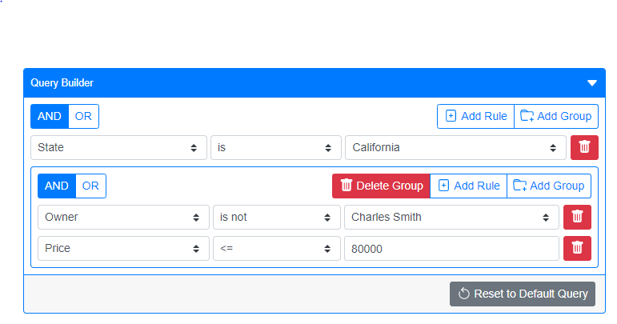

# vue-json-query-builder
> vue-json-query-builder is a Vue UI component to assist users in creating complex queries in JSON format.



### Documentation
- [How to use vue-json-query-builder](https://afineedge.github.io/vue-json-query-builder/)

## Dependencies
- [BootstrapVue](https://bootstrap-vue.org/)

## Project setup
```
npm install vue-json-query-builder
```

## To import and register
```
import VueJSONQueryBuilder from 'vue-json-query-builder';
Vue.use(VueJSONQueryBuilder);
```
The component itself does not include any CSS. To use the intended styling, you'll need to include BootstrapVue separately.

If BootstrapVue classes and custom variables are intended to be applied to the component, BootstrapVue must be added and any custom variables must be defined before adding VueJSONQueryBuilder.
```
import 'bootstrap/dist/css/bootstrap.css'
import 'bootstrap-vue/dist/bootstrap-vue.css'

import { BootstrapVue, IconsPlugin } from 'bootstrap-vue';
Vue.use(BootstrapVue);
Vue.use(IconsPlugin);

import VueJSONQueryBuilder from 'vue-json-query-builder';
Vue.use(VueJSONQueryBuilder);
```
